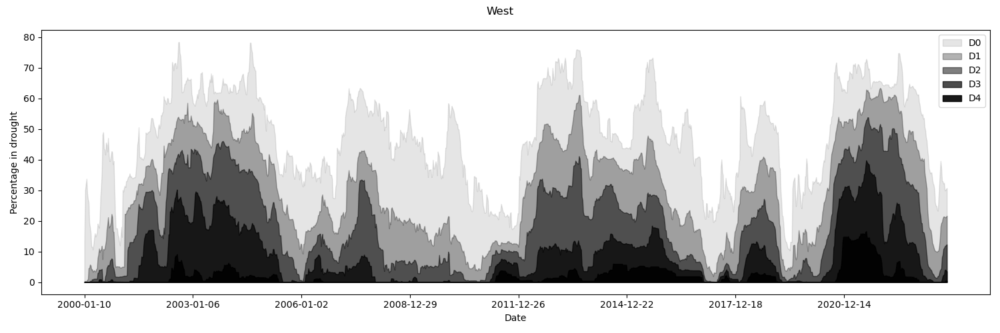

# US-Drought-Data: analysis through recurrent neural networks

**How well can one predict the future extent of drought in state, just using knowledge of present and past drought levels?** 


Drought can be costly. 
Rain is needed to restore reservoirs and water crops. 
Droughts can cause billions of dollars worth of damage to agriculture, for example the 2020-2022 drought in California caused around [2 billion USD](https://wsm.ucmerced.edu/wp-content/uploads/2022/11/Economic_Impact_CA_Drought_V01.pdf) worth of damage. 
Being able to predict the probability of drought can help farmers, city planners, and state water regulators adjust their usage of limited water resources before they are strained by lower than average rain and snowfall.

The [Southwestern North American megadrought](https://en.wikipedia.org/wiki/Southwestern_North_American_megadrought) began in 2020, and is arguably still ongoing. Theoretical work in climate science (that is, the results from large scale climate simulations) suggest that droughts may become more common in the U.S. west as atmospheric carbon dioxide levels go up. 

Regardless of long-term changes, here we explore if there is any way to predict the composition of drought (the percentage of each drought category) $n$ weeks into the future, at the state, climate region, and national (contiguous united states) level. 
The traditional approach to predicting drought would be to run a climate/weather model that includes dozens/hundreds/thousands of free paramters, that would would either guess at or directly measure. 

1. My first goal here is explore how well one can do by only using past and current drought information.
My approach is partially inspired by work by [Gerd Gigerenzer](https://www.mpib-berlin.mpg.de/staff/gerd-gigerenzer) on modeling flue outbreaks using only the number of people who have the flu. For more discussion about what he did, see this [link](https://behavioralscientist.org/gigerenzer-one-data-point-can-beat-big-data/). 
2. My second goal is to learn more about recurrent neural networks (RNNs), and how to implement them in pytorch.  

The upshot of all this is that it seems pretty hard to predict future drought information multiple weeks into the future is fairly difficult given only past drought information.
We did fairly well predicting the levels of drought only one week in advance though--even the simple guess of assuming next week nothing changes does fairly well.

If you think there is something that I could improve in my analysis, please let me know.
This is not a formal report or paper, but I would like to improve my results, and I would like to increase my knowledge of recurrent neural networks. 
Certainly including more data would be useful, such as the atmospheric moisture levels and barometric data, as generally 

1. low pressure + high moisture = rain 
2. high pressure + dry = no rain

## About the U.S. Drought monitor

The [U.S. Drought monitor](https://droughtmonitor.unl.edu/CurrentMap.aspx) (USDM) keeps comprehensive statistics on how much of the country is in drought. The monitor is updated weekly, and its easy to download data that goes as far back as Jan 1, 2020 from their online data portal. The USDM rates the level of drought in a given geographical area (e.g. state) as 
- None: no drought
- D0: Abnormally dry
- D1: Moderate drought
- D2: Severe drought
- D3: Extreme drought
- D4: Exceptional drought

along with percentage in that region that is classified as D0, etc. The USDM also provides a Drought Severity and Coverage Index (DSCI), for a region, which is the following agregate statistic 
 
$DCSI = D0 \times 1 + D1 \times 2 + D2 \times 3 + D3 \times 4 + D4 \times 5$ 

In a few different notebooks, I consider drought statistics at the state, climate region, and national level. 
The USDM provides drought data at the county level.
Statistics at the county level though are somewhat noisy, since drought often affects a wide area (e.g. at the county level, usually either the whole county is drought free or the whole county is in drought).
Because of this, I focus on data at the state level for larger states (e.g. California, Texas, Florida, New York), at the level of climate rgions, and at the national level. 
Of course, it would be more useful for planners/farmers to have predictivity at that level, but that will likely require more data and drought estimators than just the current level of drought. 

All the data I used can be found on the [USDM Data Download page](https://droughtmonitor.unl.edu/DmData/DataDownload.aspx).
The USDM data is very clean; I did not have to clean anything before use.

## Note on data



The way the USDM format their drought percentage data is that the percentages in each category obey $D0\geq D1\geq D2\geq D3 \geq D4$. For example, if 100% of a state is in D1 drought, then 100% is in D0 drought. If you want to know how much of a state is really in D0 drought, you need to look at $D0-D1$.

# Dependencies

If you want to run the exact same environment I used, run
```
conda env create -f environment.yml
``` 
