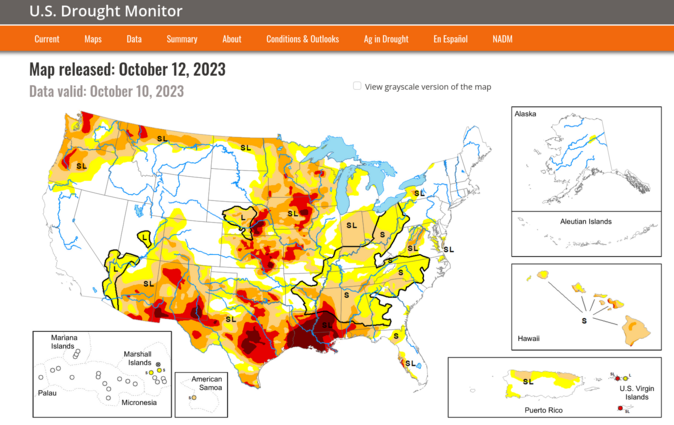

# US-Drought-Data: analysis through recurrent neural networks

Justin Ripley, 2023

Drought can be costly. 
Rain is needed to restore reservoirs and water crops. 
Droughts can cause billions of dollars worth of damage to agriculture, for example the 2020-2022 drought in California caused at around [2 billion](https://wsm.ucmerced.edu/wp-content/uploads/2022/11/Economic_Impact_CA_Drought_V01.pdf) dollars worth of damage. 
Being able to predict the probability of drought can help farmers, city planners, and state water regulators adjust their usage of limited water resources before they are strained by lower than average rain and snowfall.

The [Southwestern North American megadrought](https://en.wikipedia.org/wiki/Southwestern_North_American_megadrought) began in 2020, and is arguably still ongoing. Theoretical work in climate science (that is, the results from large scale climate simulations) suggest that droughts may become more common in the U.S. west as atmospheric carbon dioxide levels go up. 

Regardless of long-term changes, here we explore if there is any way to predict the composition of drought (the percentage of each drought category) $n$ weeks into the future, at the state, climate region, and national (contiguous united states) level. 
The traditional approach to predicting drought would be to run a climate/weather model that includes dozens/hundreds/thousands of free paramters, that would would either guess at or directly measure. 

1. Four first goal is explore how well one can do by only using past and current drought information (our approach is partially inspired by work on modeling flue outbreaks using only the number of people who have the flu, see for example https://behavioralscientist.org/gigerenzer-one-data-point-can-beat-big-data/). 
2. Our second goal is to learn more about recurrent neural networks (RNNs), which are used in modeling time-series data. 

## About the U.S. Drought monitor

The [U.S. Drought monitor](https://droughtmonitor.unl.edu/CurrentMap.aspx) (USDM) keeps comprehensive statistics on how much of the country is in drought. The monitor is updated weekly, and its easy to download data that goes as far back as Jan 1, 2020 from their online data portal. The USDM rates the level of drought in a given geographical area (e.g. state) as 
- None: no drought
- D0: Abnormally dry
- D1: Moderate drought
- D2: Severe drought
- D3: Extreme drought
- D4: Exceptional drought

along with percentage in that region that is classified as D0, etc. The USDM also provides a Drought Severity and Coverage Index (DSCI), for a region, which is the following agregate statistic 
 
$DCSI = D0 \times 1 + D1 \times 2 + D2 \times 3 + D3 \times 4 + D4 \times 5$ 

In a few different notebooks, we consider drought statistics at the state, climate region, and national level. 
The USDM provides drought data at the county level.
Statistics at the county level though are somewhat noisy, since drought often affects a wide area (e.g. at the county level, usually either the whole county is drought free or the whole county is in drought).
Because of this, we focus on data at the state level for larger states (e.g. California, Texas, Florida, New York), at the level of climate rgions, and at the national level. 
Of course, it would be more useful for planners/farmers to have predictivity at that level, but that will likely require more data and drought estimators than just the current level of drought. 

I downloaded this data from the [USDM Data Download page](https://droughtmonitor.unl.edu/DmData/DataDownload.aspx).

## Note on data

The way the USDM format their drought percentage data is that the percentages in each category obey $D0\geq D1\geq D2\geq D3 \geq D4$. For example, if 100% of a state is in D1 drought, then 100% is in D0 drought. If you want to know how much of a state is really in D0 drought, you need to look at $D0-D1$. 
